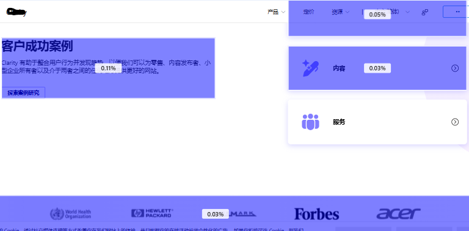
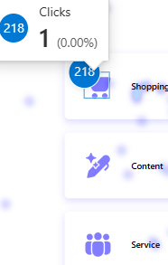

# Where PLG Homepages Lose Users: A Microsoft Clarity Acquisition-Funnel Analysis

## Contents

- [Executive Summary](#executive-summary)
- [Problem Statement](#problem-statement)
- [Background](#background)
- [Disclaimer and Ethical Considerations](#disclaimer-and-ethical-considerations)
- [Methodology](#methodology)
- [Key Insights](#key-insights)
  - [Findings and Severity](#findings-and-severity)
- [Product Decisions and Recommendations](#product-decisions-and-recommendations)
  - [Decision Matrix](#decision-matrix)
- [Metrics and Experimentation Plan](#metrics-and-experimentation-plan)
  - [Metrics Dashboard](#metrics-dashboard)
  - [Experiment Plan](#experiment-plan)
- [Business Impact](#business-impact)
- [Study Constraints and Next Steps](#study-constraints-and-next-steps)
- [Resources](#resources)

## Executive Summary
Microsoft Clarity's homepage, as recorded in Clarity's public demo environment, showed a steep engagement decay below the hero section, with click shares that fell from 29.65% in the navigation bar and 15.69% in the hero to 6.08% at the average fold, then stayed under 1.2% in every area measured beneath it, a pattern consistent with [ Nielsen Norman Group's 2018 scroll-behavior research](https://www.nngroup.com/articles/scrolling-and-attention/). What makes this decline especially costly is that the page's conversion actions sit almost entirely at the top, in the hero and in a navigation bar that stays pinned to the top of the screen, and while another signup button does sit near the footer, the banner holding it drew just 0.11% of clicks, so attention lost below the hero is largely attention lost moving away from where conversion actually happens on this page. This analysis drew on heatmap and session-replay data covering 35,879 page views, 45,221 clicks across 227 tracked elements, and 35,809 session recordings over a seven-day window, expanded from an initial Nigeria-only filter that proved too small to sustain trend analysis. 

Two priority decisions follow, ranked by severity. First, the homepage should correct the misleading interactive signals on both desktop and mobile, from the hero text and product visuals where dead and rage clicks concentrated to the mid-page sliding visual that both sampled mobile sessions repeatedly tried to swipe. Second, it should reposition the underused "Explore Case Studies" CTA, which recorded 14 clicks against 45,221 total interactions, 0.03% of all activity. For a PLG SaaS product, this disconnect between attention and conversion opportunity has a direct, though directional, implication for signups, since every visitor who disengages before encountering a working affordance or a visible secondary conversion path is a visitor the funnel loses earlier than it needs to.

## Problem Statement
The problem this analysis documents is not visitors bouncing from the homepage, which the study did not measure. It is visitors who stay, try to engage, and fail, a pattern that appeared in all five sampled sessions. While a bounce can simply mean disinterest, the dead clicks and rage clicks on static hero and product-feature elements point to a page promising interactivity it did not deliver. Much of this happened in the hero, which together with the navigation bar above it forms the page's highest-traffic zone and carries the primary sign-in and "Get Started" calls to action.

The visitors this page is built to convert are prospects evaluating adoption of Clarity as their own analytics tool, arriving with enough intent to explore the homepage but not yet committed to signing up, though its traffic also includes existing users on their way to sign in. The mismatch between what the page signals and what it delivers sits at the acquisition stage of the PLG funnel, and the same confusion recurs within the product-feature zone designed to showcase value pre-signup. In a market where PostHog, FullStory, and Contentsquare, which now takes Hotjar's new signups, offer highly accessible alternatives, a homepage that generates confusion rather than confidence is a conversion liability, since a prospect who hits resistance here can easily switch to a competitor.

A resolved version of this problem would show up in two places. First, dead and rage clicks across the hero and product-feature zones, along with failed swipe attempts on the mobile mid-page slider, would fall clearly once the misleading signals are corrected. Second, the "Explore Case Studies" CTA would draw clearly more than the 0.03% share of clicks it recorded during the study, giving the page's secondary conversion path a real opportunity to perform. The  [Metrics and Experimentation Plan](#metrics-and-experimentation-plan) sets out how each would be measured, the first through a before-and-after comparison and the second through a controlled test.

## Background
Microsoft Clarity is a free, product-led analytics platform offering heatmaps, session recordings, and behavioral telemetry. Because Clarity acquires users the way a PLG SaaS product does, through free, self-serve signup with no sales step, its own marketing website works as a fair stand-in for PLG SaaS homepage design patterns generally, even though Clarity itself has no paid tier. This analysis was completed in May 2025 as part of a structured product management program, with documentation and publication finalized afterward.

Working through this dataset followed the same discipline as a live product discovery sprint, defining the question first, testing it against the data on hand, and adapting scope the moment the data stopped supporting the original question. The original scope targeted Nigerian user sessions specifically, to evaluate localized usability trends. But that subset returned just 362 page views, 370 clicks across 41 tracked elements, and 317 session recordings across the study window, too small for reliable trend analysis. Expanding to the global dataset was a methodological adaptation, giving the analysis enough volume to support trend analysis.

## Disclaimer and Ethical Considerations
All images and brand assets of Microsoft Clarity shown in this repository are used for educational, analytical, and portfolio purposes only. The data is sourced from Microsoft Clarity's publicly available demo environment, and all rights to Clarity's interface and branding belong to Microsoft. Brand assets are used for illustrative and analytical purposes only. The analysis, interpretations, and recommendations in this case study are my own and do not represent Microsoft or any affiliated entity. This project does not use or expose any real user personally identifiable information (PII).  

## Methodology
This analysis combined two complementary methods, heatmap area insights to see where clicks concentrated across the visitors, and session recordings to see how individual visitors actually moved through the page. Heatmaps are strong on breadth, showing which zones draw attention across tens of thousands of visits, but they cannot explain why a visitor clicked somewhere or what they were trying to do. Session recordings help answer that by showing intent and hesitation in real time, at the cost of covering far fewer visitors. 

Heatmap review covered the full homepage, including the navigation bar, hero section, content blocks, the customer success section, and footer, using [Clarity's own Area Insights feature](https://learn.microsoft.com/en-us/clarity/heatmaps-overview) to quantify click concentration by zone and scroll depth to track how far visitors progressed before dropping off. That review, alongside the session recordings, surfaced the dead clicks and false-affordance patterns running through this case study, clicks landing on elements that looked interactive but were not.

The data came from [Microsoft Clarity's own publicly available demo environment](https://clarity.microsoft.com/demo/projects/view/3t0wlogvdz/heatmaps), not from a live product this analysis managed or a specific company's user base, which shapes how far these findings can reasonably travel.The demo tracks Clarity's own marketing site, and its traffic volume is consistent with real visitors, though Microsoft does not document how demo data is collected or filtered. That makes these patterns reasonable evidence for general PLG SaaS homepage engagement and affordance patterns, but they say nothing about how a specific product's own user cohort would behave, since Clarity's demo traffic reflects whoever visited the site during the study window rather than a defined target user base. This analysis reports where clicks landed, as Clarity recorded them, rather than inferring how individual elements responded, and Microsoft has since redesigned the homepage, so the screenshots here may differ from the live site.

Filtering originally targeted Nigerian sessions across Chrome, Edge, Android, iOS, Windows, and MacOS, the same subset referenced in Background that returned too little volume to sustain trend analysis. Session recordings covered five sessions in total, three on desktop and two on mobile, each selected for running at least one minute and including at least five interactions. Within those sessions, the analysis tracked rage clicks, navigation loops, hesitation, drop-off points, and scroll behavior, comparing patterns across device types.

 |Timeframe                  | Device                 | 
 |:-------------------------:|:----------------------:|
 |||

 *Figure 1: Timeframe and device filter*

 Together, these methods support a precise account of this homepage during this seven-day window, covering which zones drew attention, which drew confusion, and where visitors stopped engaging. What they cannot do is establish causation or generalize beyond it, since heatmaps show where people click but not why, session recordings add texture while remaining observational, and five sessions, two of them on mobile, is not a sample large enough to support claims about how users behave in general. The findings here identify patterns worth testing further, not conclusions to act on without validation.

## Key Insights

**Attention concentration at the top, and what it says about who is actually on the page**

The four most-clicked elements on the page all sat in the navigation bar, the hero, or the sign-in modal. Sign in drew 8,082 clicks, 17.87% of the total. Sign in with Google drew 6,749 clicks, 14.92%. Sign in with Microsoft drew 3,165 clicks, 7.00%. Get Started drew 2,584 clicks, 5.71%. Together these four accounted for 45.51% of all 45,221 clicks recorded on the page, and Area Insights confirmed the same concentration at the zone level, with the navigation bar holding 29.65% of total activity and the hero 15.69%.

These clicks cannot be split cleanly into returning users and new ones. The navigation "Sign in" button, with 8,082 clicks, is the element most likely to draw people who already have an account. The Google and Microsoft options work differently, because [Clarity has no separate registration form](https://clarity.microsoft.com/blog/website-setup/). New users create an account through the same Google, Microsoft, and Facebook buttons that returning users sign in with, so those 9,914 clicks count first-time signups and returning logins together. They also likely overlap with the clicks above, because the modal holding those buttons opens only after a visitor clicks a sign-in or signup button, so a visitor who signs in with Google registers two clicks, one on "Sign in" and one on the Google option. What the data does show is that 39.80% of all clicks went to the three sign-in options, while the hero's "Get Started" button, one of two signup buttons at the top of the page, drew 5.71%.

"Get Started" sits as a clearly visible primary button in the hero section, styled prominently alongside "See live demo." Its modest share of total clicks may say less about whether visitors can find it than about how many of them need it, since new visitors could also start from the navigation bar's signup button. If a large share of this traffic already has an account, a highly visible "Get Started" button will still post a modest click count, simply because most of the audience walking past it doesn't need to click it. Confirming that split through a returning-versus-new visitor segmentation would tell Clarity's team whether "Get Started" is underperforming among the new visitors it's built for, or performing exactly as expected given who is actually on the page.

 |Sign in CTA                  |  Modal sign up CTAs sidebar metrics | Get started CTA                 |
 |:---------------------------:|:-----------------------------------:|:-------------------------------:|
 | | ||

*Figure 2: High interaction zones on the navigation bar, hero, and sign-in modal*

**What scroll depth reveals that click share alone does not**

Scroll depth tracking showed 100% of visitors viewed the hero and navigation zone, 89.73% viewed the average fold zone just above the product visual, dropping to 75% partway down it, and 66.83% scrolled far enough to see the footer. Area Insights, measuring where clicks actually landed rather than where the page was simply visible, showed a much steeper decline, with 29.65% of clicks in the navigation bar and 15.69% in the hero, 6.08% and 1.03% at the average fold, 1.12% and 0.89% in the content zone, 0.11% and 0.20% in the footer, and 0.11%, 0.05%, 0.03%, and 0.03% in the customer success zone.

Two-thirds of visitors scrolled far enough to see the footer, yet the footer captured close to none of the page's clicks, with 0.11% across the signup banner above its links, 0.20% across the footer links area, and a single click on the social media icons row. That makes simple scroll fatigue an unlikely explanation on its own, since most visitors were still there. What the numbers showed instead is that content below the hero failed to earn interaction even from visitors who saw it, which points to a relevance or design problem at that point in the page rather than a visibility problem alone.

In the product features section, the band holding the feature tabs drew 6.08% of all clicks, more than any area below the hero, while the area beneath it, which holds the feature description, the "Learn about heatmaps" button, and the product visual, drew 1.03%, even though scroll depth data shows 89.73% of visitors reached the average fold just above the product visual, with 75% still scrolling partway down it. The drop below the tabs doesn't come from a missing element. The zone holds a row of feature tabs, Heatmaps, Session Recordings, Insights, and Google Analytics, plus a "Learn about heatmaps" button, and session recordings show visitors clicking on the tabs and on the descriptive text around the button, though not on the button itself. What the zone lacks is a conversion path tied to that interest. None of the page's conversion actions sit within this section. Sign in and a second signup button sit in the navigation bar, which stays pinned to the top of the screen as visitors scroll, and Get Started sits in the hero above, but all three are general entry points placed apart from the feature a visitor is exploring, while the Google and Microsoft sign-in options sit inside a modal rather than on the page and the footer's signup button sits even further down. A visitor clicking on these tabs is showing exactly the interest a signup depends on, exploring what the product actually does, and placing a way to sign up beside the feature itself, rather than leaving it to general entry points elsewhere on the screen, would let the page capture that interest at the moment it's strongest.

 |Navigation/hero area           |Average fold area              |
 |:-----------------------------:|:-----------------------------:|
 |||
 

 |Content Area                    | Footer Area                         | Customer Success Area         |
 |:------------------------------:|:-----------------------------------:|:-----------------------------:|
 | |       ||
 
*Figure 3: Area Insights heatmap gradients for the high and low engagement zones, with a popularity color scale.*

 |Navigation/hero zone                        |  Average fold zone                     | Footer zone                               |
 |:------------------------------------------:|:--------------------------------------:|:-----------------------------------------:|
 ||||

*Figure 4: Scroll depth for the navigation and hero, average fold, and footer zones*

**Elements that look interactive but are not, driving measurable frustration**

Clarity's session replay data captured timestamps showing dead clicks, rage clicks, and text selection events across all five sessions, concentrated on static hero text, in the page's highest-traffic zone, and on product-feature visuals further down, with desktop sessions in particular showing repeated clicks, dead clicks, rage clicks, and text selection on hero text that never responded. Mobile sessions showed the same underlying problem rather than a different one. Visitors clicked on empty space beside the hero buttons, paused on dense testimonial text, and backtracked between sections, the same kind of hesitation and misread static content desktop sessions produced. Mobile added one behavior desktop never showed, repeated attempts in both sampled mobile sessions to swipe or tap the mid-page sliding visual in the integrations section, treating it as an interactive carousel. Three of the five sampled sessions overall, spanning both devices, showed this kind of visible hesitation or back-and-forth navigation.

The most likely cause is styling, not anything visitors did wrong on either device. Bold hero text and image blocks positioned like buttons signal interactivity they do not deliver, so clicking is the reasonable response to what the page looks like, not a misunderstanding on the visitor's part. On mobile, the sliding visual adds a second version of the same problem, a gesture cue with nothing behind it, and a touch interface makes that mismatch land harder, since a visitor's hand is already positioned to act when the swipe produces nothing. When a click or a swipe gets no response, a visitor has no signal that the element was decorative, and may read the silence as a sign that something about the product is not working.

Because much of this happened in the hero, the zone carrying "Get Started" directly beneath the navigation bar's sign-in and signup buttons, correcting these signals would protect the page's highest-value space rather than a peripheral part of the design. Neither device can be set aside, since PC and Mobile are the only two categories this analysis covered, and both showed visitors doing the reasonable thing and getting nothing back for it. Reserving button styling, hover states, and underlines for elements that actually respond would let both layouts signal accurately what a visitor can act on, and replacing the mid-page sliding visual with a static image would remove the one gesture cue mobile visitors had no reason to rely on.

 

*Figure 5: Desktop users interaction pattern*

|User clicked on empty spaces| User attempted to swipe/click visuals | User paused on dense text blocks    | User backtracked between sections |
|:--------------------------:| :------------------------------------:| :---------------------------------: | :---------------------------------:|
|  |             |           |       |

*Figure 6: Mobile users interaction pattern*

     

*Figure 7: Text selection, rage click, and dead click timestamps during session replay*

**The page's lowest-attention zones, and a CTA caught in the same pattern**

The page's lowest-attention zones extend the same pattern established above. Area Insights gave the customer success zone, which holds the page's "Customer success stories" block, its category cards, and a row of company logos, four separate readings, 0.11%, 0.05%, 0.03%, and 0.03%, and the icon on one of those cards, Shopping, effectively recorded a single click, 0% of total activity, matching the footer's social icons at that same near-zero level. The "Explore Case Studies" CTA, a separate element from the "Case Studies" link in the footer's Resources column, recorded 14 clicks out of 45,221 total interactions, 0.03% of all activity.

The "Explore Case Studies" CTA sits below the average fold, inside the customer success zone's "Customer success stories" block, whose area drew 0.11% of clicks, less than a tenth of the content zone's 1.12% and 0.89%. The CTA and the zone around it show the same outcome as the footer, content that draws almost no action, most plausibly because a position this far down the page and unremarkable styling give a visitor no particular reason to stop and click.

A call to action sitting in a zone that gets this little visual priority cannot prove whether it works, regardless of how many visitors technically scroll past it. Moving "Explore Case Studies" directly beneath the hero, where attention and click share both concentrate, would give the element an actual test of its value rather than leaving it to compete for interaction it has no realistic chance of winning.

 |Customer success category card  | Footer links                 | Explore Case Studies CTA    |
 |:------------------------------:|:----------------------------:|:---------------------------:|
 ||||

*Figure 8: ow interaction zones on a customer success category card, footer links, and Explore Case Studies CTA*

**Why the sign-in modal's clicks do not show in the heatmap**

The Google and Microsoft sign-in options sit inside a modal rather than on the page. The modal appeared automatically during filter customization but not in the default heatmap screenshots, while Clarity's sidebar metrics recorded substantial engagement with it, 6,749 clicks on Sign in with Google, 14.92%, and 3,165 on Sign in with Microsoft, 7.00%.

Clarity's own documentation accounts for this. [Its FAQ notes](https://learn.microsoft.com/en-us/clarity/faq) that heatmaps track dynamic elements such as pop-ups, but that these might not be visible in the default heatmap, while the panel that ranks elements by clicks, the sidebar metrics cited here, includes dynamic ones, and selecting an element there refreshes the heatmap to show it. The click counts therefore stand as recorded, and the modal's absence from the screenshots reflects how Clarity displays dynamic elements rather than a problem with how the clicks were tracked.

### Findings and Severity

The table below rates every finding in this section on a four-level scale. Critical marks a finding that blocks a core action such as sign-in or the primary CTA, High marks one affecting the page's highest-traffic zone, Medium marks one affecting a secondary zone, and Low marks a cosmetic or edge-case issue. Traffic here means share of clicks from Area Insights, which makes the hero and navigation zone the highest-traffic zone on the page. No finding reaches Critical, since sign-in and "Get Started" both drew substantial clicks and nothing on the page blocked them. Severity measures how much a finding hurts visitors, while priority reflects the decision it feeds, so a Medium finding can sit under a High-priority decision.

| Page Zone or Element | Observation | Root Cause | Severity | Recommended Decision | Priority |
|---|---|---|---|---|---|
| Hero and product-feature zones, both devices | Dead clicks, rage clicks, and text selection appeared across all five sessions, including rage clicks and text selection on static hero text on desktop and clicks on empty space beside the hero buttons on mobile | Styling signals interactivity these elements do not deliver | High | Decision 1, reserve button styling and hover states for elements that respond | High |
| Product-features zone | Clicks landed on the feature tabs and on the text around "Learn about heatmaps" rather than the button itself, the band holding the tabs drew 6.08% of clicks and the area beneath it 1.03%, and 89.73% of visitors reached the average fold above the product visual, with 75% still scrolling partway down it|No conversion action sits within this section, only general entry points in the sticky navigation bar and the hero above it, and the "Learn about heatmaps" button did not draw the clicks aimed near it | Medium | Decision 1, make each tab open that feature's view in Clarity's public demo environment, with a signup CTA alongside it | High |
|Integrations slider, mid-page, mobile| Repeated swipe and tap attempts in both sampled mobile sessions | A gesture cue with nothing behind it | Medium | Decision 1, replace with a static image on mobile | High |
| Mid-page sections, both devices | Hesitation and back-and-forth navigation in three of five sessions, and on mobile, pauses on dense testimonial text and sessions that ended without reaching the footer's signup CTA | Dense text and image blocks, documented most clearly just below the product features | Medium | Break these blocks into shorter, scannable sections as a follow-up test after Decision 1 | Low |
| "Explore Case Studies" CTA | 14 clicks, 0.03% of all activity, ranked 97th of 227 tracked elements | Most plausibly, a position far down the page and unremarkable styling | Medium | Decision 2, move directly beneath the hero | Medium |
|Content and customer success zones| The content zone drew 1.12% and 0.89% of clicks, the customer success zone 0.11%, 0.05%, 0.03%, and 0.03%, and its Shopping card's icon one click | Most plausibly, the same low position and unremarkable styling | Medium | No separate action, this low engagement is the reason Decision 2 would move the CTA out of this area | Low |
| Footer | 66.83% of all visitors reached it, though none of the five sampled sessions did. The signup banner above its links drew 0.11%, the footer links area 0.20%, and the social icons row one click | A relevance or design problem rather than a visibility one | Medium | No separate action, monitor after Decisions 1 and 2 ship | Low |
| Sign-in options versus "Get Started" | Sign-in options drew 39.80% of clicks and "Get Started" drew 5.71% |The two actions overlap in intent, since new visitors create accounts through the same Google and Microsoft buttons returning users sign in with| Not rated, interpretation finding | Segment new and returning visitors before judging "Get Started" performance | Not ranked |

## Product Decisions and Recommendations

Both decisions below answer one pattern that ran through the page. Visitors either tried to act on elements that gave them nothing back, or reached content and moved past it without acting, most plausibly because the actions worth taking sat somewhere they were not looking

**Decision 1. Correct the misleading interactive signals on desktop and mobile**

- **Decision.** The homepage should reserve interactive styling, such as hover states, underlines, and button treatments, for elements that actually respond, and restyle static hero text and product-feature blocks so they no longer read as clickable. Where visitors clearly try to act, the page should respond rather than discourage them, so each feature tab should open that feature's view in Clarity's public demo environment, with a signup CTA shown alongside it rather than in front of it. On mobile, the mid-page sliding visual should be replaced with a static image.
- **Rationale.** Dead clicks, rage clicks, and text selection appeared across all five sessions, concentrated on static hero text in the zone holding the largest share of the page's clicks, 29.65% in the navigation bar and 15.69% in the hero area, and on product-feature visuals further down the page. Restyling beats removing these elements outright, because the hero text and product visuals carry the page's value proposition, and deleting them would trade a signaling problem for a content one. The feature tabs call for the opposite treatment, since visitors were already clicking on them, enough to give the band holding them 6.08% of all clicks, more than any area below the hero, and sending those clicks straight to the feature itself would give that interest the shortest path to the product. Opening the demo without a signup wall would keep faith with the "100% free" promise in Clarity's own hero, which a gate in front of that first look would undercut. On mobile, a static image is a stronger choice than keeping the slider with clearer swipe cues, because it removes the ambiguity entirely rather than asking visitors to learn how the slider works.
- **Expected impact.** No test has run yet, so this is a directional estimate rather than a measured result. Dead clicks, rage clicks, and swipe attempts should fall, and more of the clicks already landing on the feature tabs should carry into the demo and on to signup. As one external reference, [Nielsen Norman Group's 2017 eyetracking study of 71 users](https://www.nngroup.com/articles/flat-ui-less-attention-cause-uncertainty/) found that participants spent 22% more time on pages with weak signifiers and  made 25% more fixations than on versions with clear ones. That study examined interactive elements that failed to look interactive, the reverse of this page's problem, but it supports the same principle that unclear signals about what responds slow visitors down and cost them confidence. Supporting the ungated approach, [Navattic's State of the Interactive Product Demo 2026 report](https://www.navattic.com/report/state-of-the-interactive-product-demo-2026), drawn from demos its own customers built rather than from this project's data, found that 66% of top-performing demos are ungated, and that ungated demos saw engagement 6% points higher and completion 7% points higher than gated ones, though gated demos drew a slightly higher click-through rate on their calls to action, 72% against 69%.
- **Trade-offs.** Restyling the hero would give up some of the visual boldness the studied design used for impact. The static image would lose the slider's ability to show several views in one space. Routing tab clicks into the demo would move visitors off the homepage and away from its own conversion actions, so the signup CTA inside each demo view would have to carry that conversion on its own. The full change would also require design and engineering work across both desktop and mobile layouts, plus linking each tab to a matching demo view.
- **Priority.** High, because it affects the page's highest-traffic zone on both devices this analysis covered.

**Decision 2. Move "Explore Case Studies" to directly beneath the hero**

- **Decision.** The homepage should move the "Explore Case Studies" CTA from its position below the average fold to directly beneath the hero section, where attention and click share are concentrated.
- **Rationale.** The CTA recorded 14 clicks, 0.03% of all activity, and ranked 97th of 227 tracked elements. It sits below the average fold, in the customer success zone, where the area holding it drew 0.11% of clicks and the zone's other readings fell as low as 0.03%. A sticky CTA on mobile was considered and set aside as a first move, because it would add a persistent element competing with the hero's own conversion actions before anyone knows whether case studies earn clicks at all. Removing the CTA was also set aside, because at this position the data cannot yet separate visitors who don't want case studies from visitors who never gave them a real look. Moving it is the most direct way to find out.
- **Expected impact.** As with Decision 1, this is a directional estimate until tested. Clicks on "Explore Case Studies" should rise once the CTA sits in the page's main attention zone. As an external reference, [Nielsen Norman Group's 2018 scrolling and attention study](https://www.nngroup.com/articles/scrolling-and-attention/) found that users spent about 57% of their page-viewing time above the fold and 74% within the first two screens of the page, which is where this move would place the CTA.
- **Trade-offs.** The space beneath the hero is the page's most contested high-impact zone. Placing case studies there would put them in competition with "Get Started" and "See live demo" for attention, and it could pull some new visitors toward reading instead of signing up. That risk is the reason this change should be tested rather than shipped outright.
- **Priority.** Medium, because it serves a secondary conversion path rather than the page's primary signup actions.

### Decision Matrix

The matrix below compares the two decisions side by side. Effort is a relative estimate between them, since neither has an engineering estimate behind it. Confidence follows the three tiers of [Intercom's RICE framework](https://www.intercom.com/blog/rice-simple-prioritization-for-product-managers/). High confidence requires measured reach, research on impact, and an engineering estimate of effort, which neither decision has. Medium requires data behind reach and effort with impact still uncertain. Decision 2 rates Medium because its reach is measured and, although no engineer has estimated its effort, moving one existing element leaves little doubt about it. A page-level dead-click count and an engineering estimate would lift Decision 1 to Medium.

| Decision | Expected Impact | Effort | Confidence Level | Key Trade-off |
|---|---|---|---|---|
| 1. Correct the misleading interactive signals on desktop and mobile | Fewer dead clicks, rage clicks, and swipe attempts, and more feature-tab clicks carried into the demo and on to signup (directional) | Medium compared with Decision 2, because it touches several elements on both desktop and mobile and also means linking each tab to its demo view | Low, because the dead and rage clicks were never counted at page level, the session evidence covers only five sessions, and restyling both layouts and linking each tab to a demo view has no engineering estimate, so effort could run higher than expected | Gives up some of the hero's visual boldness and the slider's multi-view space, and sending tab clicks into the demo moves visitors away from the homepage's own conversion actions |
| 2. Move "Explore Case Studies" directly beneath the hero | More clicks on "Explore Case Studies" above its 0.03% baseline (directional) |Low compared with Decision 1, because it moves one element that already exists | Medium, because the low click share comes from large-sample data and external attention research supports the move, while whether visitors want case studies at all is still untested | Competes with "Get Started" and "See live demo" in the page's most contested space |

## Metrics and Experimentation Plan

Every percentage attached to a page element earlier in this case study is a share of all recorded clicks. A share like that can rise or fall when other elements gain or lose clicks, even when nothing about the element itself has changed, so the click metrics below use clicks per page view instead, calculated from the same documented counts. Where this dataset has no baseline for a metric, the table says so, and that baseline would be measured before any change goes live rather than guessed now.

### Metrics Dashboard

| KPI | Definition | Baseline | Target | Measurement Method |
|---|---|---|---|---|
| Dead and rage clicks on non-responsive elements, by device | Dead and rage clicks or taps landing on static hero text, product-feature visuals, and the mobile mid-page area where the slider sat, per 1,000 page views, split into desktop and mobile | Seen across all five sampled sessions but not documented numerically, measured over the two weeks before launch | A fall after launch (directional) | Clarity's dead-click and rage-click tracking, filtered by zone and device |
| "Explore Case Studies" clicks per page view | Clicks on the CTA divided by homepage page views | About 0.04%, from 14 clicks across 35,879 page views, equal to 0.03% of all clicks | At least double, to about 0.08%, the Test 1 threshold | A/B testing platform, cross-checked against Clarity click counts |
| "Get Started" clicks per page view, guardrail | Clicks on "Get Started" divided by homepage page views | About 7.2%, from 2,584 clicks across 35,879 page views, equal to 5.71% of all clicks | No statistically significant drop during Test 1 | A/B testing platform, cross-checked against Clarity click counts |
| Signup starts per homepage visitor | Homepage visitors who start signing up during the same session, whether from the homepage or a demo view, divided by all homepage visitors | Not documented, measured in a pre-test period | At least a 10% relative lift, the Test 2 threshold | A/B testing platform with signup-start event tracking |

The restyling and the slider replacement from Decision 1 would ship straight away rather than wait for a test. They correct clear usability failures rather than bet on new behavior, and current experimentation guidance,[ including Mixpanel's](https://mixpanel.com/blog/product-experimentation/), holds that problems of that kind do not need an experiment to prove they should be corrected. Both changes can also be rolled back if the numbers move the wrong way, which keeps the risk of shipping them without a test low. These two changes would go live before either test begins, and the first KPI above would compare the two weeks before launch with the two weeks after. That before-and-after comparison is weaker than a controlled test, since outside factors can move the same numbers, which is why nothing else on the page should change during that window.

Both tests follow the standard most experimentation teams use, 95% confidence and 80% statistical power, with the smallest lift worth acting on fixed before the test starts and never adjusted mid-test. [Nielsen Norman Group's A/B testing guidance](https://www.nngroup.com/articles/ab-testing/) adds that a test should run at least one to two weeks even when traffic is plentiful, to account for normal swings in user behavior. For Test 1, that standard shapes the threshold directly. At a baseline of about 0.04% clicks per page view, detecting a 20% relative lift would take roughly 1.1 million page views per variant, and a 50% lift roughly 201,000. A doubling needs about 60,000 per variant, about 24 days at the traffic this dataset recorded. Given how much of visitors' attention stays within the first two screens of the page, as the research cited in Decision 2 found, moving a CTA that ranked 97th of 227 tracked elements into the page's main attention zone is the kind of change that can plausibly double its clicks, so a doubling is both detectable and worth acting on.

### Experiment Plan

| Test Name | Hypothesis | Control | Variant | Primary Metric | Success Threshold |
|---|---|---|---|---|---|
| Test 1. "Explore Case Studies" beneath the hero |Moving the CTA from below the average fold to directly beneath the hero will at least double its clicks per page view without lowering "Get Started" clicks, because it will sit in the page's main attention zone| Current page, with the CTA below the average fold | The same page, with the CTA directly beneath the hero and nothing else changed | "Explore Case Studies" clicks per page view, with "Get Started" clicks per page view as the guardrail | At least a doubling from about 0.04%, at 95% confidence and 80% power, with no significant drop in "Get Started," after at least two full weeks and about 60,000 page views per variant |
| Test 2. Feature tabs open demo views | Letting each feature tab open that feature's view in Clarity's public demo environment, with a signup CTA alongside it, will raise signup starts per homepage visitor, because visitors who show interest in a feature will see it straight away with a path to sign up | Current tab behavior | Each tab opens that feature's demo view, with a signup CTA shown alongside it rather than in front of it |Signup starts per homepage visitor, with the share of tab-clicking visitors who go on to start signing up as a secondary metric | At least a 10% relative lift, the smallest gain worth the engineering effort, at 95% confidence and 80% power, over at least two full weeks, with sample size calculated from a pre-test baseline |

A positive result in Test 1 would support shipping the new placement, as long as "Get Started" holds steady. If "Explore Case Studies" gains clicks while "Get Started" drops significantly, the page would be trading signup intent for case-study reading, and the placement should not ship in that form. A null result would mean something different, that even in the page's main attention zone the CTA did not draw twice the interest, which suggests the offer or its wording limits clicks more than its position does. Because the test is sized to detect a doubling, a real but smaller lift could still go undetected, so a null result makes a large effect unlikely rather than ruling out every effect.

A positive result in Test 2 would support rolling the tab change out to every visitor. A null result there would suggest that earlier access to the product does not move signups on its own, and the team would review the demo views themselves before trying again.

## Business Impact
For a PLG SaaS product, the homepage's first job is to turn anonymous visitors into free signups, and both decisions in this case study work at that acquisition stage. Correcting the misleading signals on the hero and product visuals would cut the clicks visitors waste on elements that give nothing back, and letting a click on a feature tab open that feature in Clarity's public demo environment would give their curiosity somewhere to go, with a signup option beside it. Moving "Explore Case Studies" up beneath the hero would do similar work for visitors who want proof before they commit. Case studies are one of the page's forms of social proof, alongside its ratings and testimonials, and with 14 clicks across a full week, almost no one was acting on them.

The effects beyond signup are harder to claim. Activation happens after someone creates an account, a stage this study never observed, though a visitor who has already explored a feature in the demo would plausibly reach signup with a clearer sense of what they are getting. Retention sits largely outside these decisions. Returning users reach the product through the sign-in options, and neither decision touches that path, though this data cannot say how many of the sign-in clicks came from them.

The business value works differently here, because Clarity has no paid tier.[ Its own pricing page explains](https://clarity.microsoft.com/pricing) that Microsoft uses anonymous behavioral data to improve the machine learning models behind many of its products, and that Clarity is one of the ways it gathers that data. For Clarity, the return is every new user who signs up and installs it on a site. This dataset holds no signup or installation figures, so that return can't be put into numbers here, and the impact stays directional. On a PLG SaaS product that does charge, the same homepage losses would cost more directly, because every visitor lost before signup is one fewer free or trial user who could later upgrade to paid.

Competition makes all of this more pressing. As of 2026,[ PostHog's free tier](https://posthog.com/pricing) includes 5,000 session replays and 1 million events a month, [Hotjar no longer accepts new accounts](https://contentsquare.com/hotjar/) and sends new users to Contentsquare's free plan, and [FullStory provides limited free access](https://www.fullstory.com/pricing/), so a prospect who leaves Clarity's homepage unconvinced can try an alternative at no cost. The "100% free" promise in Clarity's own hero only helps if visitors stay long enough to take it up. There is also a credibility cost particular to this product. A visitor evaluating a behavior analytics tool is, at least in part, judging how well its makers understand user behavior, and a homepage that produces the very dead and rage clicks the product is built to detect gives that visitor an early reason to doubt it.

## Study Constraints and Next Steps
Five sessions, two of them on mobile, is too small a sample to support statistical claims, so the findings drawn from session recordings are directional signals rather than validated conclusions. The click and scroll figures stand on firmer ground, since they come from 45,221 clicks across 35,879 page views, though they show where visitors clicked and scrolled rather than why. All of this data comes from Clarity's public demo environment rather than a defined user cohort, as [Methodology](#methodology) sets out. Two further limits follow from how the analysis itself was done. The severity ratings in the [Findings and Severity](#findings-and-severity) table reflect a single analyst's judgment, and [Jakob Nielsen's guidance](https://www.nngroup.com/articles/how-to-rate-the-severity-of-usability-problems/) calls single-evaluator ratings too unreliable on their own and recommends averaging them across several independent evaluators, so they are best read as a reasoned first pass rather than a settled ranking. And because the study moved to global data, it says nothing about Nigerian visitors specifically, which leaves the localized question it originally set out to answer open, and worth returning to once enough Nigerian sessions exist to support it.

Three next steps would close the main questions this analysis leaves open. The first is the follow-up test on the dense text and image blocks just below the product features, run after Decision 1 ships, measuring how many visitors scroll past those sections, with its threshold set once the new page gives a baseline. The second would use [Clarity's own user-type filter](https://learn.microsoft.com/en-us/clarity/filters/clarity-filters) to separate new visitors from returning ones before anyone judges "Get Started," since the sign-in options that drew 39.80%% of clicks serve new visitors creating an account as well as returning users signing in. The third would strengthen the behavioral evidence itself, replacing the five selected sessions with a larger random sample of new visitors split by device, and adding at least two more analysts to rate severity independently, so ratings can be averaged across three. Pairing that sample with a short survey, asking visitors who leave without signing up what they expected to find, would add what heatmaps and recordings cannot capture, the reasons behind the behavior.

## Resources
[Browse all the raw analysis screenshots](./images/)

-----------------------------------------------------------------------------------------------------------------------------
  
*Questions or feedback on this analysis are welcome via [LinkedIn](https://www.linkedin.com/in/fortuneegbai/).*

